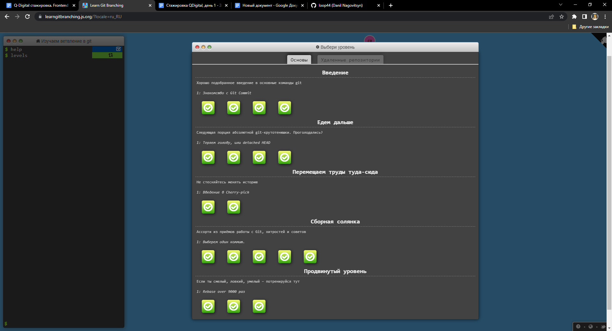
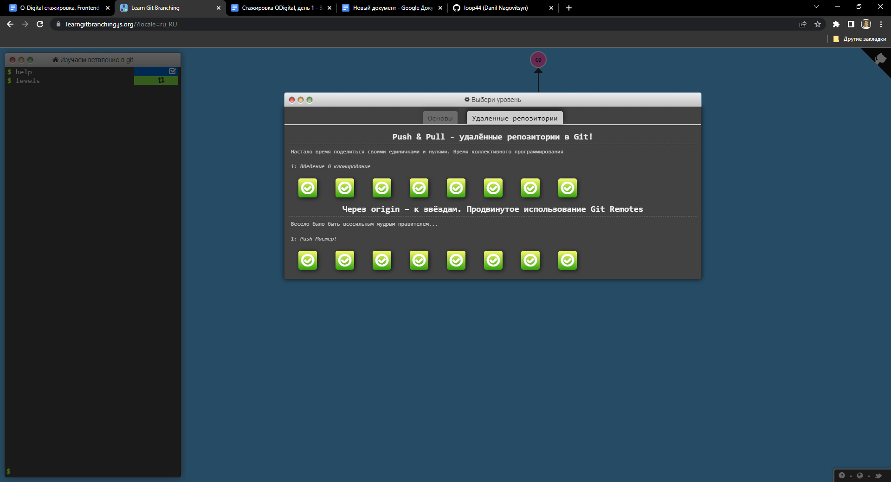
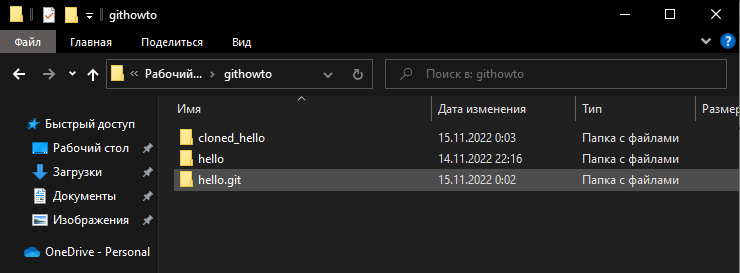

# Q-digital. Итоги стажировки по Frontend-направлению

## Задание 0 - Работа с Git

- Упражнения с https://learngitbranching.js.org:
    - 
    - 
- Туториал с https://githowto.com/ru:
    - Скриншот с общей папки с полученными репозиториями: 
    - Репозиторий в котором проводилась вся работа: https://github.com/loop44/githowto 

## Задание 1 - Работа с версткой (Pixel perfect)

- Репозиторий проекта: https://github.com/loop44/pc-courses-pixel-perfect 
- Github pages: https://loop44.github.io/pc-courses-pixel-perfect/

## Задание 2 - Работа с версткой (Tailwind)

- Репозиторий проекта: https://github.com/loop44/adaptive-tailwind-table 
- Github pages: https://loop44.github.io/adaptive-tailwind-table/index.html

## Задание 3 - Работа с кодом (JS)

- Репозиторий проекта: https://github.com/loop44/vanilla-js-library
- Github pages: https://loop44.github.io/vanilla-js-library/

## Задание 4 - работа с проектированием и реализацией (Добавление фичи в существующий проект)

- Репозиторий проекта: https://github.com/loop44/guitars-task
- Github pages: https://loop44.github.io/guitars-task/

## Задание 5 - Работа с ООП

- Репозиторий проекта: https://github.com/loop44/planes-oop
- Github pages: https://loop44.github.io/planes-oop/

## Задание 6 - Работа с React

- Репозиторий проекта: https://github.com/loop44/react-mul-table/tree/main
- Deployed: https://react-mul-table.netlify.app/

